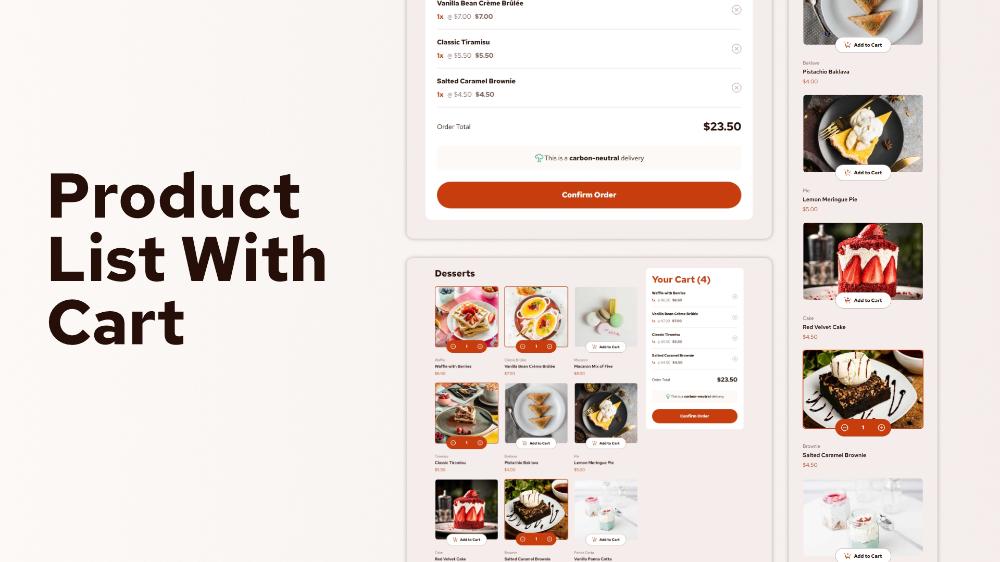

# Frontend Mentor - Browser extensions manager UI solution

A simple product list project featuring a functional cart where you can add and remove items.

## Overview

### The challenge

Users should be able to:

- Toggle extensions between active and inactive states
- Filter active and inactive extensions
- Remove extensions from the list
- Select their color theme
- View the optimal layout for the interface depending on their device's screen size
- See hover and focus states for all interactive elements on the page

### Screenshot



### Links

- Solution URL: [https://github.com/nikosetiawanp/product-list-with-cart](https://github.com/nikosetiawanp/product-list-with-cart)
- Live Site URL: [Add live site URL here](https://your-live-site-url.com)

## My process

### Built with

[](#)
[](#)
[](#)

### What I learned

#### 🎯 Learning Goals

- Learning to use Svelte for the first time
- Experience how similar Svelte is to vanilla javascript

#### 🚧 Challenges & Solutions

- Coming from react, I initially struggled to grasp Svelte's way of prop drilling, especially on passing down functions from parent to child. But here's a way to do it :

```javascript
  // +page.svelte
  <script>
    let addToCart = (id: number) => {
      const product = products.find((product: Product) => product.id == id);
      cartItems = [...cartItems, { ...(product as Product), quantity: 1 }];
    };
  </script>

  <ProductCard
    onIncrement={increment}
  />
```

```javascript
//ProductCard.svelte
<script>
  export let onAddToCart: (id: number) => void;
</script>

<button onclick={() => onAddToCart(product.id)}>Add to Cart</button>
```

#### ⚙️ Technical Skills

- Basic use of Svelte 5
- Svelte app deployment to github pages
- Creating custom theme on Tailwind v4

#### 💡 Key Takeaways

- Svelte is great for beginners to grasp basic frontend concepts, as it feels similar to vanilla javascript, while still maintain key concepts of other frameworks, such as state management, props, and components.
- It's better to get your themes down before building your app. It will save you tons of time in styling.

#### Bonus

- I added simple logic to simulate loading when confirming order, before opening the confirmation modal.

```javascript
  <script>
    let isLoading = false;
    let confirmModalOpen = false;
    const confirmOrder = () => {
    isLoading = true;
    setTimeout(function () {
      isLoading = false;
      confirmModalOpen = true;
    }, 1000);
  };
  </script>

  <button
  class="w-full bg-red text-white font-bold rounded-full px-6 py-4 hover:cursor-pointer hover:bg-red-hover disabled:bg-rose-300 transition-all"
  onclick={() => confirmOrder()}
  disabled={isLoading ? true : false}
  >{isLoading ? "Placing Order..." : "Confirm Order"}
  </button>
```

### Continued development

- Since this is a challenge from Frontend Mentor and a way to practice using certain tools, there are no plans for further development.

### Useful resources

- [https://tailwindcss.com/](https://tailwindcss.com/) - Essential docs to use tailwindcss.
- [https://svelte.dev/docs/svelte/overview](https://svelte.dev/docs/svelte/overview) - Start from here, and read first few pages to quickly learn svelte basics.

## Author

- Website - [Niko Setiawan P](https://github.com/nikosetiawanp/)
- Frontend Mentor - [@nikosetiawanp](https://www.frontendmentor.io/profile/nikosetiawanp)
